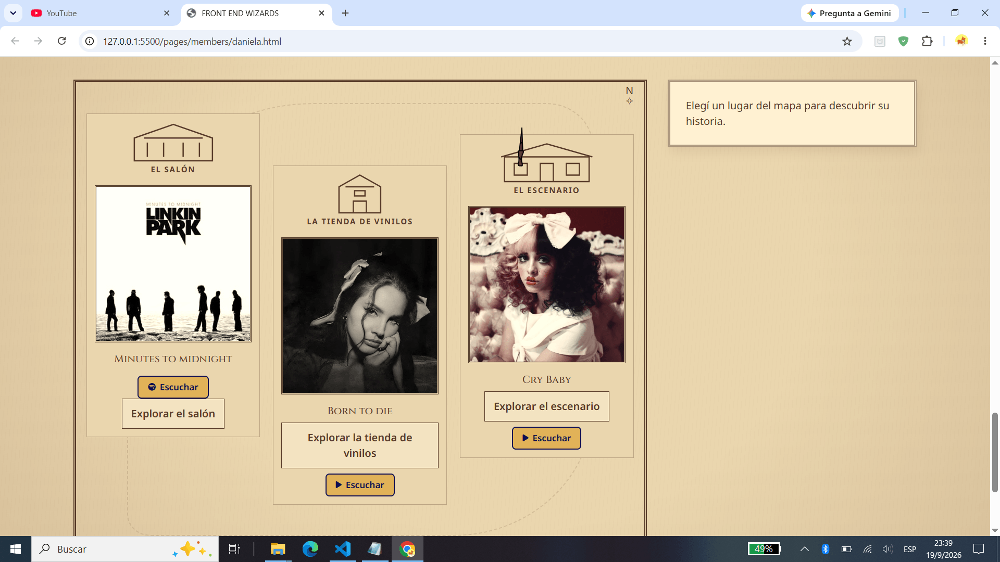
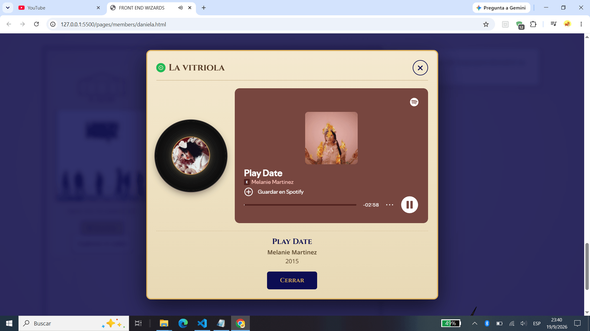
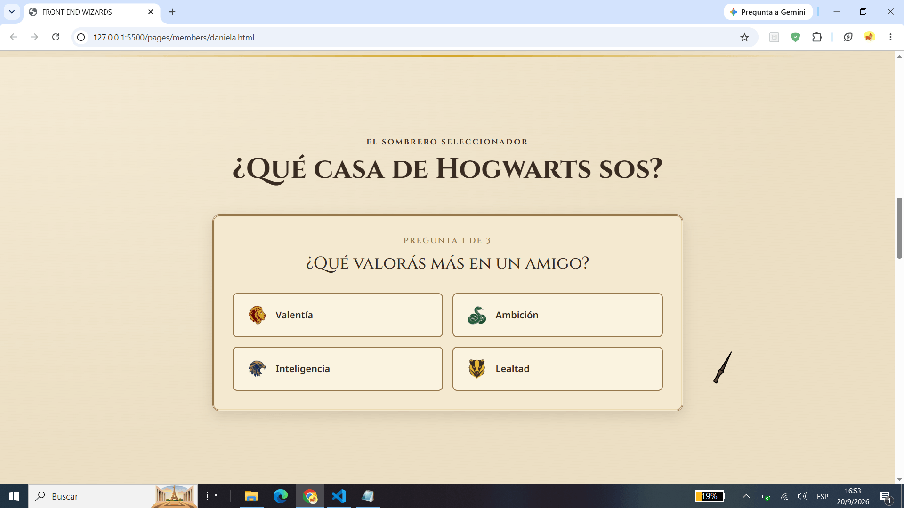
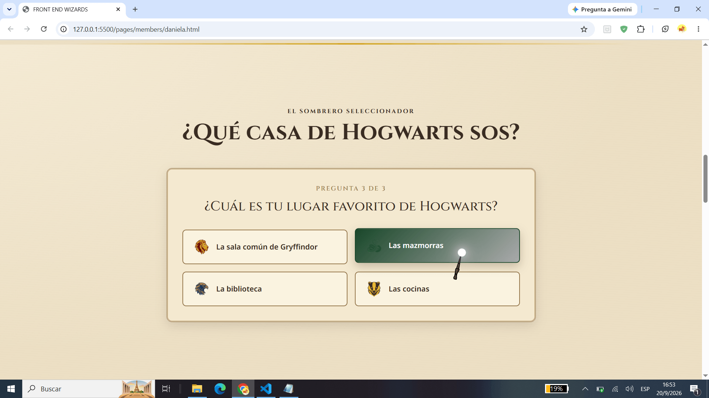

# 🪄 Hallows Code — TP1 Front End

Proyecto web grupal desarrollado para el **Trabajo Práctico 1** de la materia *Desarrollo de Sistemas Web (Front End)* del IFTS 29, 2° cuatrimestre 2026.

Hallows Code es un sitio web con temática Harry Potter que presenta al equipo de desarrollo, sus perfiles individuales (con habilidades, películas y discos favoritos) y una bitácora del proceso de trabajo. Incluye interactividad con JavaScript en cada perfil.

---

## 👥 Integrantes

| Nombre | GitHub | Perfil |
|---|---|---|
| Alejandro Ramos | [@AleR25](https://github.com/AleR25) | [alejandro.html](./pages/members/alejandro.html) |
| Daniela Méndez | [@mendez-daniela](https://github.com/mendez-daniela) | [daniela.html](./pages/members/daniela.html) |
| Lucas Sosa | [@Strashoy](https://github.com/Strashoy) | [lucas.html](./pages/members/lucas.html) |
| Sol Prinzen | [@solprinz](https://github.com/solprinz) | [sol.html](./pages/members/sol.html) |

---

## 🛠️ Tecnologías utilizadas

- **HTML5** — estructura semántica y accesible
- **CSS3** — estilos personalizados, variables CSS y responsive
- **JavaScript (vanilla)** — interactividad dinámica
- **Bootstrap 5.3** — grilla, navbar y componentes responsive
- **Google Fonts** — Cinzel, Caveat, Noto Sans
- **Font Awesome 6.2** — iconografía

---

## 📁 Estructura del proyecto

\`\`\`
tp1-front/
├── index.html                      # Portada principal
├── README.md                       # Este archivo
├── css/
│   └── style.css                   # Estilos globales
├── fonts/
│   └── LUMOS.TTF                   # Fuente temática
├── img/                            # Imágenes del proyecto
│   ├── alejandro.jpg
│   ├── alejandro-hallows-logo.png  # Logo del equipo
│   ├── alejandro-hallows-titulo.png
│   ├── daniela/                    # Imágenes de Daniela
│   │   ├── black-swan.jpg
│   │   ├── coraline-pelicula.jpg
│   │   ├── daniela-avatar.jpg
│   │   ├── habilidades-daniela.jpg
│   │   ├── heuh-pelicula.jpg
│   │   ├── lana-rey.jpg
│   │   ├── melaniemartinez.jpg
│   │   └── minutes-to-midnight-lp.jpg
│   ├── lucas.jpg
│   ├── lucas-cancion1.jfif
│   ├── lucas-cancion2.jfif
│   ├── lucas-cancion3.jfif
│   ├── lucas-pelicula1.jpg
│   ├── lucas-pelicula2.jpg
│   ├── lucas-pelicula3.jfif
│   ├── lucas-proyecto1.png
│   ├── lucas-proyecto2.png
│   ├── lucas-proyecto3.png
│   ├── patronus-ciervo.png
│   ├── patronus-sol.png
│   ├── perfil-discos.png
│   ├── perfil-habilidades.png
│   ├── perfil-peliculas.png
│   ├── perfil-proyectos.png
│   ├── sol.jpg
│   ├── sol-cancion1.png
│   ├── sol-cancion2.png
│   ├── sol-cancion3.png
│   ├── sol-habilidades.jpg
│   ├── sol-pelicula1.png
│   ├── sol-pelicula2.png
│   ├── sol-pelicula3.png
│   └── varita.svg
├── js/
│   ├── cursor.js                   # [COMPLETAR descripción]
│   ├── header-hallows.js           # [COMPLETAR descripción]
│   ├── main.js                     # [COMPLETAR descripción]
│   ├── mapa-favoritos.js           # [COMPLETAR descripción]
│   └── proyectos-reliquias.js      # [COMPLETAR descripción]
└── pages/
    ├── logbook/
    │   └── bitacora.html           # Bitácora del proceso
    └── members/
        ├── alejandro.html
        ├── daniela.html
        ├── juanpablo.html          # (pendiente)
        ├── lucas.html
        └── sol.html
\`\`\`

---

## 🎨 Guía de estilos

### Paleta de colores

**Colores base**
| Variable | Hex | Uso |
|---|---|---|
| `--primary` | `#0d0d53` | Azul noche principal |
| `--secondary` | `#e1b258` | Dorado principal |
| `--acento` | `#f4d081` | Dorado claro |
| `--gray` | `#6c757d` | Gris neutro |
| `--white` | `#ffffff` | Blanco |
| `--black` | `#000000` | Negro |
| `--lightgray` | `#e0e0e0` | Gris claro |
| `--shadow` | `#e1b2584d` | Sombra dorada |

**Colores por casa de Hogwarts**
| Casa | Color 1 | Color 2 | Color 3 |
|---|---|---|---|
| Gryffindor | `#740001` | `#d3a625` | `#000000` |
| Slytherin | `#1a472a` | `#aaaaaa` | `#000000` |
| Ravenclaw | `#0e1a40` | `#946b2d` | `#5d5d5d` |
| Hufflepuff | `#ecb939` | `#372e29` | `#726255` |

**Colores temáticos Hallows**
| Variable | Hex | Uso |
|---|---|---|
| `--hallows-oro` | `#d6b66d` | Dorado Hallows |
| Fondo | `#17130f` | Marrón oscuro |
| Detalle claro | `#e1bd69` | Detalles dorados |
| Detalle oscuro | `#9c793e` | Bordes y acentos |

### Tipografías
- **Cinzel** — títulos principales (estilo grabado medieval)
- **Caveat** — subtítulos manuscritos
- **Noto Sans** — cuerpo de texto (legibilidad)

### Iconografía
- **Font Awesome 6.2** — íconos (redes, hamburguesa, flechas)

### Breakpoints
- **400px** — mobile
- **900px** — tablet
- **1200px** — desktop

---

## ⚡ Funciones JavaScript

[COMPLETAR: cada integrante describe brevemente la función dinámica de su perfil + una captura de pantalla]

### Portada (`index.html`)
- **[COMPLETAR]**

### Perfil Daniela (`daniela.html`) — `mapa-favoritos.js`

Mapa interactivo con temática Harry Potter que permite explorar las **películas** y **discos** favoritos. Cada favorito es un "lugar" en el plano mágico; al hacer click se abre una ficha con información detallada. Incluye navegación completa por teclado y mensajes de estado accesibles para lectores de pantalla.

**Funcionalidades principales:**
- Apertura y cierre del mapa ("Juro solemnemente…" / "Travesura realizada")
- Selección de lugares individuales con ficha desplegable
- Toggle: click en el mismo lugar cierra su ficha
- Navegación por teclado (`Escape` cierra la ficha activa)
- Gestión de foco para accesibilidad (devuelve el foco al botón original)
- Mensajes dinámicos de estado con `aria-live` y `role="status"`
- Atributos ARIA completos (`aria-expanded`, `aria-controls`)

**Estructura técnica:**
- IIFE + `"use strict"` para encapsulamiento
- Múltiples instancias: se aplica a las secciones de películas y discos a la vez
- Selectores basados en `data-*` para desacoplar del HTML

---

### Perfil Daniela (`daniela.html`) — `vitriola.js`

**🎩 La Vitriola**: reproductor modal que permite escuchar las canciones destacadas de cada disco favorito usando **Spotify embed**. Se abre al hacer click en los botones "▶ Escuchar" de la sección de discos.

**Funcionalidades principales:**
- Apertura del modal con el disco seleccionado (Linkin Park, Lana Del Rey, Melanie Martinez)
- Carga dinámica del reproductor de Spotify según el disco clickeado
- Vinilo girando con la portada del disco (animación CSS)
- Cierre con botón, "Cerrar", click en overlay o tecla `Escape`
- **Trampa de foco** para navegación por teclado (accesibilidad)
- Gestión de foco: devuelve el foco al botón que abrió el modal
- Bloqueo de scroll del body cuando el modal está abierto
- Atributos ARIA (`role="dialog"`, `aria-modal`, `aria-labelledby`, `aria-describedby`)

**Estructura técnica:**
- IIFE + `"use strict"` para encapsulamiento
- Objeto `DISCOS` con la info de cada uno (canción, artista, año, portada, embed)
- Creación dinámica del iframe según el tipo de embed
- Uso de Font Awesome para el ícono de Spotify

---

### Perfil Daniela (`daniela.html`) — `quiz-casas.js`

**🎩 El Sombrero Seleccionador**: quiz interactivo de 3 preguntas que determina a qué casa de Hogwarts pertenece el usuario. Se suman puntos según las respuestas y al final se muestra la casa ganadora con su color característico.

**Funcionalidades principales:**
- 3 preguntas con 4 opciones cada una (una por casa)
- Suma de puntos según las respuestas
- Cálculo de casa ganadora
- Resultado con color según la casa (Gryffindor, Slytherin, Ravenclaw o Hufflepuff)
- Botón "Jugar de nuevo" para reiniciar
- Navegación por teclado y gestión de foco (accesibilidad)

**Estructura técnica:**
- IIFE + `"use strict"` para encapsulamiento
- Objeto `RESULTADOS` con la info de cada casa
- Estados: pregunta actual y puntajes
- Uso de `hidden` para mostrar/ocultar preguntas
- Imágenes generadas con IA para los íconos de cada casa

### Perfil Alejandro (`alejandro.html`)
- **[COMPLETAR]**

### Perfil Lucas (`lucas.html`)
- **[COMPLETAR]**

### Perfil Sol (`sol.html`)
- **[COMPLETAR]**

---

## 🚀 Publicación

- **Repositorio GitHub:** https://github.com/solprinz/tp1-grupo20
- **Vercel:** https://tp1-grupo20.vercel.app/

---

## 🤖 Uso de IA

[COMPLETAR: describir herramientas de IA usadas, modelos, plan (gratuito/pago), para qué se usaron (código, debugging, redacción, imágenes), y qué revisaron/adaptaron con criterio propio.]

### Herramientas utilizadas
| Herramienta | Modelo | Plan | Uso principal |
|---|---|---|---|
| [COMPLETAR] | [COMPLETAR] | [COMPLETAR] | [COMPLETAR] |

### Criterio de uso
[COMPLETAR]

### Imágenes y avatares
[COMPLETAR: ¿se generaron con IA? ¿cuál fue el criterio de los prompts?]

---

## 📈 Evolución

Esta sección documentará las mejoras planificadas para los próximos trabajos prácticos:

- [COMPLETAR: mejoras futuras]