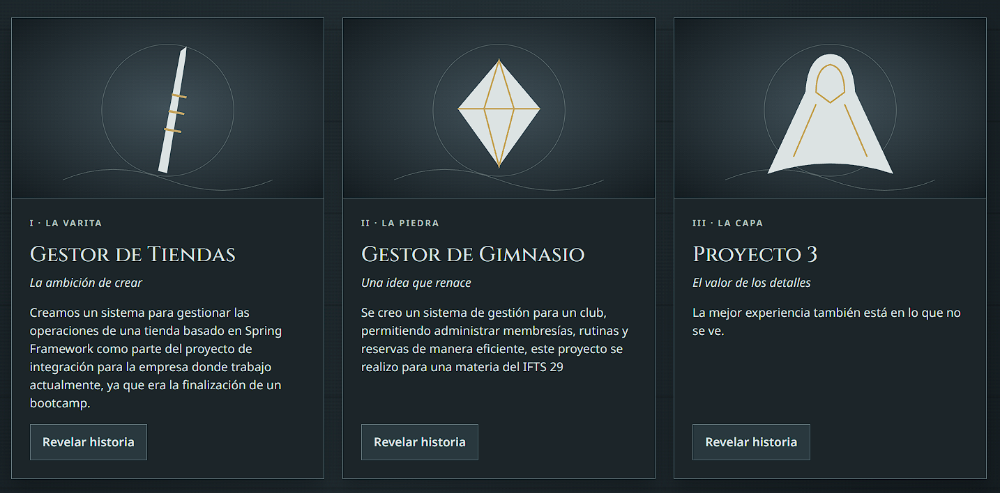
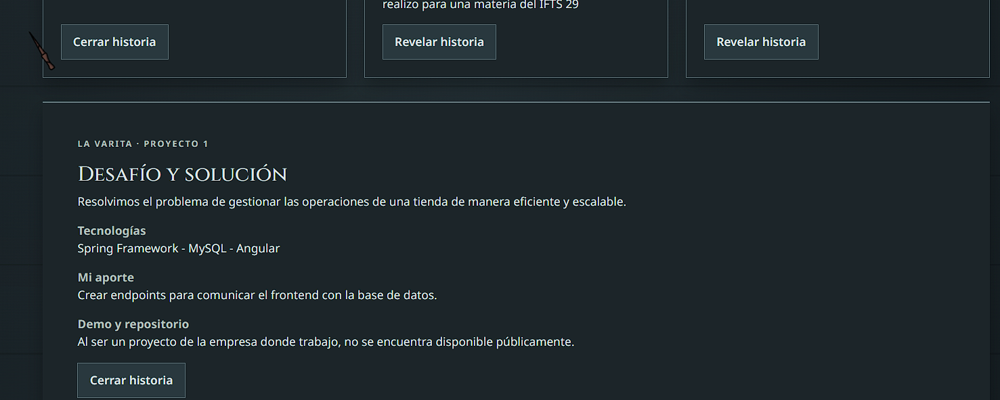
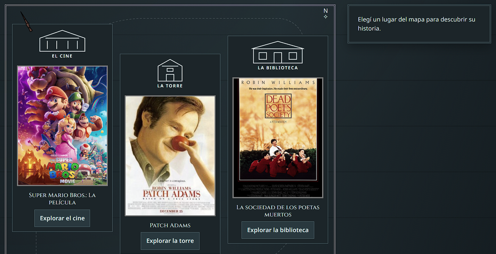
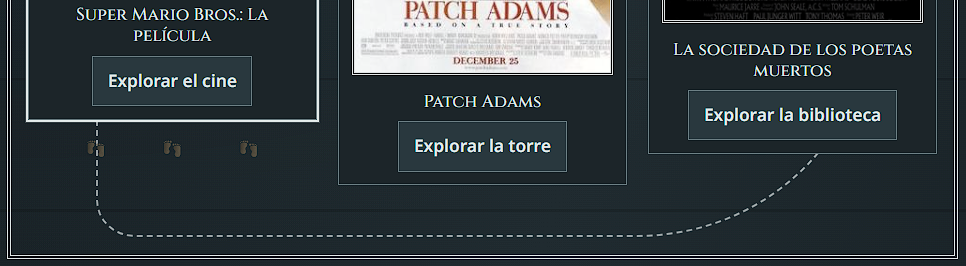
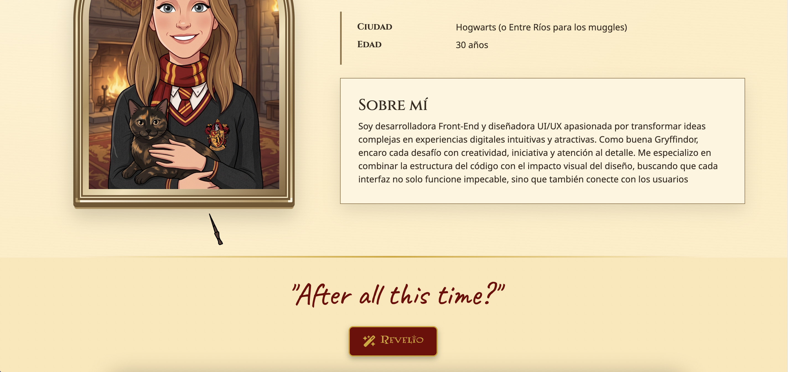
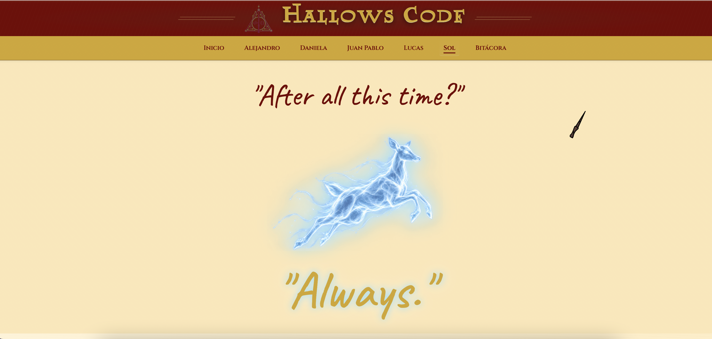

# 🪄 Hallows Code — TP1 Front End

Proyecto web grupal desarrollado para el **Trabajo Práctico 1** de la materia _Desarrollo de Sistemas Web (Front End)_ del IFTS 29, 2° cuatrimestre 2026.

Hallows Code es un sitio web con temática Harry Potter que presenta al equipo de desarrollo, sus perfiles individuales (con habilidades, películas y discos favoritos) y una bitácora del proceso de trabajo. Incluye interactividad con JavaScript en cada perfil.

---

## 👥 Integrantes

| Nombre          | GitHub                                               | Perfil                                           |
| --------------- | ---------------------------------------------------- | ------------------------------------------------ |
| Alejandro Ramos | [@AleR25](https://github.com/AleR25)                 | [alejandro.html](./pages/members/alejandro.html) |
| Daniela Méndez  | [@mendez-daniela](https://github.com/mendez-daniela) | [daniela.html](./pages/members/daniela.html)     |
| Juan Pablo      | [@JPFinal](https://github.com/JPFinal)               | [juanpablo.html](./pages/members/juanpablo.html) |
| Lucas Sosa      | [@Strashoy](https://github.com/Strashoy)             | [lucas.html](./pages/members/lucas.html)         |
| Sol Prinzen     | [@solprinz](https://github.com/solprinz)             | [sol.html](./pages/members/sol.html)             |

---

## 🛠️ Tecnologías utilizadas

- **HTML5** — estructura semántica y accesible
- **CSS3** — estilos personalizados, variables CSS y responsive
- **JavaScript (vanilla)** — interactividad dinámica
- **Bootstrap 5.3** — grilla, navbar y componentes responsive
- **Google Fonts** — Cinzel, Caveat, Noto Sans.
- **Font Awesome 6.2** — iconografía

---

## 📁 Estructura del proyecto

\`\`\`
tp1-front/
├── index.html # Portada principal
├── README.md # Este archivo
├── css/
│ └── style.css # Estilos globales
├── docs/
│ └── capturas/ # Capturas para el README
├── fonts/
│ └── LUMOS.TTF # Fuente temática
├── img/ # Imágenes del proyecto
│ ├── alejandro.jpg
│ ├── alejandro-hallows-logo.png # Logo del equipo
│ ├── alejandro-hallows-titulo.png
│ ├── daniela/ # Imágenes de Daniela
│ │ ├── black-swan.jpg
│ │ ├── coraline-pelicula.jpg
│ │ ├── daniela-avatar.jpg
│ │ ├── habilidades-daniela.jpg
│ │ ├── heuh-pelicula.jpg
│ │ ├── lana-rey.jpg
│ │ ├── melaniemartinez.jpg
│ │ └── minutes-to-midnight-lp.jpg
│ ├── juanpablo.jpg # Avatar de Juan Pablo
│ ├── juanpablo/ # Portadas de Juan Pablo
│ │ ├── avengers-infinity-war.jpg
│ │ ├── comfort-musica-volar.jpg
│ │ ├── fulanos-de-nadie.jpg
│ │ ├── terminator.jpg
│ │ ├── vivire-viajando.jpg
│ │ └── warcraft.jpg
│ ├── quiz/ # Íconos del quiz de casas
│ │ ├── aguila.png
│ │ ├── leon.png
│ │ ├── serpiente.png
│ │ └── tejon.png
│ ├── lucas.jpg
│ ├── lucas-cancion1.jfif
│ ├── lucas-cancion2.jfif
│ ├── lucas-cancion3.jfif
│ ├── lucas-pelicula1.jpg
│ ├── lucas-pelicula2.jpg
│ ├── lucas-pelicula3.jfif
│ ├── lucas-proyecto1.png
│ ├── lucas-proyecto2.png
│ ├── lucas-proyecto3.png
│ ├── patronus-ciervo.png
│ ├── patronus-sol.png
│ ├── perfil-discos.png
│ ├── perfil-habilidades.png
│ ├── perfil-peliculas.png
│ ├── perfil-proyectos.png
│ ├── sol.jpg
│ ├── sol-cancion1.png
│ ├── sol-cancion2.png
│ ├── sol-cancion3.png
│ ├── sol-habilidades.jpg
│ ├── sol-pelicula1.png
│ ├── sol-pelicula2.png
│ ├── sol-pelicula3.png
│ └── varita.svg
├── js/
│ ├── cursor.js # Cursor personalizado (global)
│ ├── header-hallows.js # Header dinámico (global)
│ ├── juan-efficiency.js # Test de eficiencia Slytherin (Juan Pablo)
│ ├── main.js # Funciones de portada (global)
│ ├── mapa-favoritos.js # Mapa interactivo (Daniela)
│ ├── proyectos-reliquias.js # Reliquias interactivas (Alejandro)
│ ├── vitriola.js # Reproductor de discos (Daniela)
│ └── quiz-casas.js # Quiz de casas (Daniela)
└── pages/
├── logbook/
│ └── bitacora.html # Bitácora del proceso
└── members/
├── alejandro.html
├── daniela.html
├── juanpablo.html
├── lucas.html
└── sol.html
\`\`\`

---

## 🎨 Guía de estilos

### Paleta de colores

**Colores por casa de Hogwarts**
| Casa | Color 1 | Color 2 | Color 3 |
|---|---|---|---|
| Gryffindor | `#740001` | `#d3a625` | `#000000` |
| Slytherin | `#1a472a` | `#aaaaaa` | `#000000` |
| Ravenclaw | `#0e1a40` | `#946b2d` | `#5d5d5d` |
| Hufflepuff | `#ecb939` | `#372e29` | `#726255` |

**Colores temáticos Hallows**
| Variable | Hex | Uso |
|---|---|---|
| `--hallows-oro` | `#d6b66d` | Dorado Hallows |
| Fondo | `#17130f` | Marrón oscuro |
| Detalle claro | `#e1bd69` | Detalles dorados |
| Detalle oscuro | `#9c793e` | Bordes y acentos |

### Tipografías

- **Cinzel** — títulos principales (estilo grabado medieval)
- **Caveat** — subtítulos manuscritos
- **Noto Sans** — cuerpo de texto (legibilidad)
- **Lumos** — tipografía temática para la identidad de marca (aplicada en el logo Hallows Code y detalles puntuales de títulos)

### Iconografía

- **Font Awesome 6.2** — íconos (redes, hamburguesa, flechas)

### Breakpoints

- **400px** — mobile
- **900px** — tablet
- **1200px** — desktop

---

## ⚡ Funciones JavaScript

### Portada (`index.html`) - Modo Oscuro "Lumos / Nox"

**Encantamiento de Iluminación ("Lumos / Nox")**: interacción que permite alternar la interfaz de la página principal entre una estética diurna y una temática nocturna de Hogwarts.

**Funcionalidades principales:**

Alternancia de tema: botón interactivo en la navegación para conmutar dinámicamente entre el modo claro (Lumos) y el modo oscuro (Nox).

- Persistencia de preferencia: uso de localStorage para recordar el modo seleccionado por el usuario en futuras visitas.

- Transición suave: adaptación gradual de colores de fondo, tarjetas, textos y componentes de navegación.

**Estructura técnica:**

- Manipulación de clases dinámicas en el body (.modo-nox) mediante classList.toggle().

- Almacenamiento y lectura del estado de la preferencia en localStorage.

- Estilos encapsulados en style.css mediante variables y selectores específicos para mantener el contraste y la legibilidad.

---

### Mapa Mágico de Favoritos (`js/mapa-favoritos.js`)
Mapa interactivo temático de Harry Potter implementado en las páginas de los integrantes para explorar **películas** y **discos** favoritos. Cada elemento actúa como un "lugar" dentro del plano mágico que, al hacer clic, despliega una ficha con información detallada.

**Funcionalidades principales:**

- Apertura y cierre del mapa ("Juro solemnemente…" / "Travesura realizada")
- Selección de lugares individuales con ficha desplegable
- Toggle: click en el mismo lugar cierra su ficha
- Navegación por teclado (`Escape` cierra la ficha activa)
- Gestión de foco para accesibilidad (devuelve el foco al botón original)
- Mensajes dinámicos de estado con `aria-live` y `role="status"`
- Atributos ARIA completos (`aria-expanded`, `aria-controls`)

**Estructura técnica:**

- IIFE + `"use strict"` para encapsulamiento
- Múltiples instancias: se aplica a las secciones de películas y discos a la vez
- Selectores basados en `data-*` para desacoplar del HTML

---

### Cursor Mágico Interactivo (`js/cursor.js`)

**Cursor Mágico Interactivo**: Implementación global que reemplaza el puntero tradicional del navegador por una varita mágica con física de movimiento, efectos de brillo dinámicos y física de desarme en el minijuego de duelo.

**Funcionalidades principales:**

- **Inyección dinámica de interfaz:** Creación autónoma e inyección directa en el DOM (`cursor-wrapper` y `cursor-falso`) al cargar el documento.
- **Seguimiento y física de rotación:** Cálculo de posición en tiempo real (`mousemove`) que ajusta la rotación dinámica de la varita según la coordenada horizontal de la pantalla.
- **Feedback interactivo (Efecto Hover):** Detección automática sobre elementos cliqueables (`a`, `button`, `input`) para activar la punta brillante (`.hover-punta`).
- **Mecánica de Duelo de Varitas (_Expelliarmus_):** Evento aleatorio (50/50) al presionar el botón de hechizo que determina si el usuario pierde la varita o si el botón sale volando por la pantalla.
- **Física de desarmado y caída:** Secuencia de tirones erráticos con trayectorias aleatorias y caída libre acelerada hasta el borde inferior de la ventana (_piso_).
- **Restablecimiento del cursor nativo:** Desactivación del cursor mágico (`duelo-perdido`) al perder el duelo para devolver los controles predeterminados del navegador.

**Estructura técnica:**

- Manipulación avanzada del DOM mediante `document.createElement()`, `appendChild()` y clases CSS dinámicas.
- Manejo de listeners globales (`mousemove`, `mouseover`, `mouseout`) y delegación de eventos con `e.target.closest()`.
- Lógica probabilística con `Math.random()` para la resolución del duelo y generación de coordenadas erráticas.
- Temporizadores asincrónicos con `setInterval()` y `setTimeout()` para secuenciar las fases de animación física, impacto y caída.

---

### Perfil Daniela (`daniela.html`) — `vitriola.js`

**🎩 La Vitriola**: reproductor modal que permite escuchar las canciones destacadas de cada disco favorito usando **Spotify embed**. Se abre al hacer click en los botones "▶ Escuchar" de la sección de discos.

**Funcionalidades principales:**

- Apertura del modal con el disco seleccionado (Linkin Park, Lana Del Rey, Melanie Martinez)
- Carga dinámica del reproductor de Spotify según el disco clickeado
- Vinilo girando con la portada del disco (animación CSS)
- Cierre con botón, "Cerrar", click en overlay o tecla `Escape`
- **Trampa de foco** para navegación por teclado (accesibilidad)
- Gestión de foco: devuelve el foco al botón que abrió el modal
- Bloqueo de scroll del body cuando el modal está abierto
- Atributos ARIA (`role="dialog"`, `aria-modal`, `aria-labelledby`, `aria-describedby`)

**Estructura técnica:**

- IIFE + `"use strict"` para encapsulamiento
- Objeto `DISCOS` con la info de cada uno (canción, artista, año, portada, embed)
- Creación dinámica del iframe según el tipo de embed
- Uso de Font Awesome para el ícono de Spotify

---

### Perfil Daniela (`daniela.html`) — `quiz-casas.js`

**🎩 El Sombrero Seleccionador**: quiz interactivo de 3 preguntas que determina a qué casa de Hogwarts pertenece el usuario. Se suman puntos según las respuestas y al final se muestra la casa ganadora con su color característico.

**Funcionalidades principales:**

- 3 preguntas con 4 opciones cada una (una por casa)
- Suma de puntos según las respuestas
- Cálculo de casa ganadora
- Resultado con color según la casa (Gryffindor, Slytherin, Ravenclaw o Hufflepuff)
- Botón "Jugar de nuevo" para reiniciar
- Navegación por teclado y gestión de foco (accesibilidad)

**Estructura técnica:**

- IIFE + `"use strict"` para encapsulamiento
- Objeto `RESULTADOS` con la info de cada casa
- Estados: pregunta actual y puntajes
- Uso de `hidden` para mostrar/ocultar preguntas
- Imágenes generadas con IA para los íconos de cada casa

---

### Perfil Alejandro (`alejandro.html`)

**⚡ El relato de las tres creaciones — `proyectos-reliquias.js`**: interacción que presenta los proyectos mediante las tres Reliquias de la Muerte (varita, piedra y capa). Cada tarjeta permite revelar una historia con detalles del proyecto, tecnologías utilizadas y aporte personal, dentro de un perfil ambientado como un expediente de Azkaban.

**Funcionalidades principales:**

- Apertura de historias con el botón **"Revelar historia"**, manteniendo una sola tarjeta abierta a la vez.
- Cierre desde el mismo botón, mediante **"Cerrar historia"** o con la tecla `Escape`.
- Resaltado de la tarjeta activa y marcado de las reliquias exploradas.
- Contador de historias visitadas, sin sumar nuevamente las tarjetas ya exploradas.
- Revelado del símbolo de las reliquias y del mensaje **"La verdadera magia está en lo que creamos."** al explorar los tres proyectos.
- Gestión de foco: al abrir una historia, el foco pasa a su título; al cerrarla, vuelve al botón de la tarjeta.
- Integración de películas y música con el componente compartido `mapa-favoritos.js`.

**Estructura técnica:**

- IIFE + `"use strict"` para encapsular la lógica.
- Selección de tarjetas e historias mediante `data-reliquia`, `data-historia` y `aria-controls`.
- Estado de tarjeta activa mediante `activa` y registro de visitas únicas con `Set`, conservado durante la visita sin persistencia en almacenamiento.
- Manipulación del DOM mediante `hidden`, `classList`, `dataset` y `textContent`.
- Actualización de `aria-expanded` y mensajes de progreso con `role="status"` y `aria-live="polite"`.
- Contenido de las historias disponible en el HTML aunque JavaScript esté deshabilitado.

---

### Perfil Juan Pablo (`juanpablo.html`) — `juan-efficiency.js`

**🐍 Slytherin Efficiency Test**: juego interactivo de prueba de reflejos y velocidad de reacción ambientado en la casa de Slytherin. El usuario inicia el desafío, el botón entra en un período de espera aleatorio ("Esperá...") y, al activarse en verde Slytherin ("¡Ahora!"), mide con precisión de milisegundos (`performance.now()`) el tiempo de reacción del usuario.

**Funcionalidades principales:**

- Medición precisa de velocidad de reacción en milisegundos (`performance.now()`).
- Respuestas temáticas dinámicas según el rendimiento:
  - `< 250 ms`: _"Reflejos de basilisco. Eficiencia suprema."_
  - `< 450 ms`: _"Rápido como una serpiente en las mazmorras."_
  - `< 700 ms`: _"Buena reacción, digno de Slytherin."_
  - `>= 700 ms`: _"Necesitás más práctica… la eficiencia requiere precisión."_
- Efecto visual de destello mágico (`crearDestello()`) en la posición del click (`position: fixed`).
- Invocación animada de la serpiente de Slytherin con resplandor mágico debajo del resultado, coordinada mediante el evento `animationend` de CSS para una eliminación limpia en el DOM.
- Integración de las secciones de **Películas** y **Discos** con el componente interactivo de mapas mágicos (`mapa-favoritos.js`).

**Estructura técnica:**

- Manejo de estados asíncronos (`esperando`, retardos dinámicos con `Math.random()`).
- Sincronización precisa entre JavaScript y animaciones CSS (limpieza del DOM ligada a `animationend`).
- Detección de coordenadas de pantalla mediante `getBoundingClientRect()`.

---

### Perfil Lucas (`lucas.html`)

- **[COMPLETAR]**

---

### Perfil Sol (`sol.html`) - Encantamiento "Always"

**Encantamiento Revelio ("Always")**: interacción dinámica que revela el Patronus de Cierva y el icónico mensaje _"Always"_ al presionar el botón de interacción en el perfil.

**Funcionalidades principales:**

- Revelado interactivo de escena mediante el botón **" 🪄 Revelio"**.
- Ocultamiento suave del botón activador y despliegue del Patronus animado.
- Feedback visual temático y transición de estado inmediata.

**Estructura técnica:**

- Manejo de eventos con `addEventListener` en el `DOMContentLoaded`.
- Control de estados mediante clases CSS (`.oculto` y `.activo`).
- Script personalizado encapsulado para no interferir con las variables del resto de la entrega.

---

### Perfil Sol (`sol.html`) - La Copa De Las Casas"

**Torneo de las Casas ("Favoritismo de Dumbledore")**: Dashboard interactivo que simula el marcador de puntos de Hogwarts con sucesos cómicos de la saga y persistencia de datos.

**Funcionalidades principales:**
-Generador de Sucesos: Botón interactivo que desencadena eventos narrativos asignando puntos a las distintas casas.
-Marcador dinámico: Visualización en tiempo real con alumnos destacados por casa y animación visual (.pop-anim) al sumar puntos.
-Persistencia con localStorage: Mantiene el estado de los contadores y el cartel de campeón incluso al recargar o reiniciar el navegador.
-Restablecimiento del Torneo: Botón de reinicio que limpia el almacenamiento local y devuelve la interfaz a su estado inicial.

**Estructura técnica:**
-Manejo de estado global persistente mediante localStorage.setItem() y localStorage.getItem().
-Manipulación modular del DOM con addEventListener centralizado en DOMContentLoaded.
-Control de flujo condicional para la deshabilitación del botón y despliegue del cartel de victoria al alcanzar el umbral de puntos.

---

## 🚀 Publicación

- **Repositorio GitHub:** https://github.com/solprinz/tp1-grupo20
- **Vercel:** https://tp1-grupo20.vercel.app/

---

## 🤖 Uso de IA

Durante el desarrollo del TP1 usamos herramientas de inteligencia artificial como **asistentes técnicos** en momentos puntuales. A continuación detallamos cómo las usamos y qué decisiones tomamos con criterio propio.

### Herramientas utilizadas

| Herramienta          | Modelo      | Plan        | Integrante | Uso principal                                                                      |
| -------------------- | ----------- | ----------- | ---------- | ---------------------------------------------------------------------------------- |
| DeepSeek             | V3          | Gratuito    | Daniela    | Consultas técnicas, debugging de JavaScript, revisión de código                    |
| Gemini (Nano Banana) | Gemini 2.5  | Gratuito    | Daniela    | Generación de los íconos del quiz de casas                                         |
| Codex                | GPT-6 Astra | Plus        | Alejandro  | Desarrollo e implementación de JavaScript manteniendo un diseño acorde a la tematica|
| [COMPLETAR]          | [COMPLETAR] | [COMPLETAR] | Lucas      | [COMPLETAR]                                                                        |
| Gemini               | 2.5 Flash   | [COMPLETAR] | Sol        | Debugging de especificidad CSS, estandarización de footer y maquetación responsive |

> Algunos integrantes contaban con **experiencia previa** en HTML, CSS y JavaScript, adquirida en cursos realizados en **Codo a Codo** o **Coderhouse**.

### Criterio de uso

La IA fue una **herramienta de apoyo** en momentos puntuales:

- **Consultas técnicas:** entender errores de CSS (especificidad) y de JavaScript (manejo de eventos, accesibilidad).
- **Revisión de código:** validar que las soluciones que ya habíamos pensado eran correctas.
- **Generación de imágenes:** crear los íconos del quiz con prompts temáticos de Harry Potter y generar los avatares ilustrados de los integrantes manteniendo la estética del proyecto.

La IA nos permitió **resolver dudas puntuales** y **profundizar en los temas** que nos generaban dificultad. Las decisiones de diseño, la arquitectura del sitio, la selección de contenido y la integración final fueron **nuestras**.

### Imágenes y avatares

Los avatares e imágenes del proyecto combinan:

- **Bancos de imágenes libres** (portadas de películas y discos)
- **Generación con IA** (íconos del quiz de casas y avatars personalizados generados con Gemini Nano Banana)
- **Diseño propio** (logos y elementos del sitio)

En todos los casos priorizamos la **estética temática de Harry Potter** y el **criterio de privacidad** (no usar fotos personales).

---

## 📈 Evolución

Esta sección documentará las mejoras planificadas para los próximos trabajos prácticos:

- **Accesibilidad:** ampliar la auditoría de accesibilidad a todo el sitio (roles ARIA, navegación por teclado, contraste).
- **Nuevas funciones dinámicas:** sumar más interactividad con JavaScript en cada perfil.
- **Optimización:** mejorar el rendimiento (compresión de imágenes, lazy loading, minificación de CSS y JS).
- **Documentación:** mantener el README actualizado con cada nueva función y captura.
- **Diseño:** explorar más componentes visuales temáticos (animaciones, transiciones).
